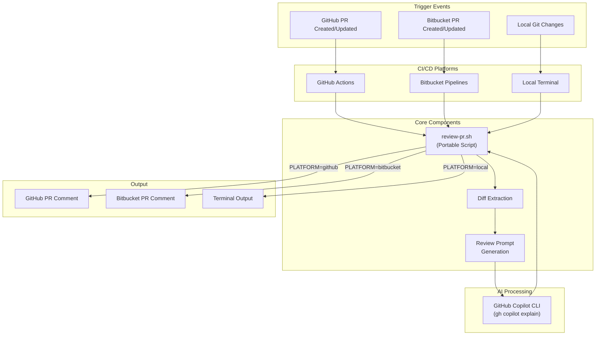
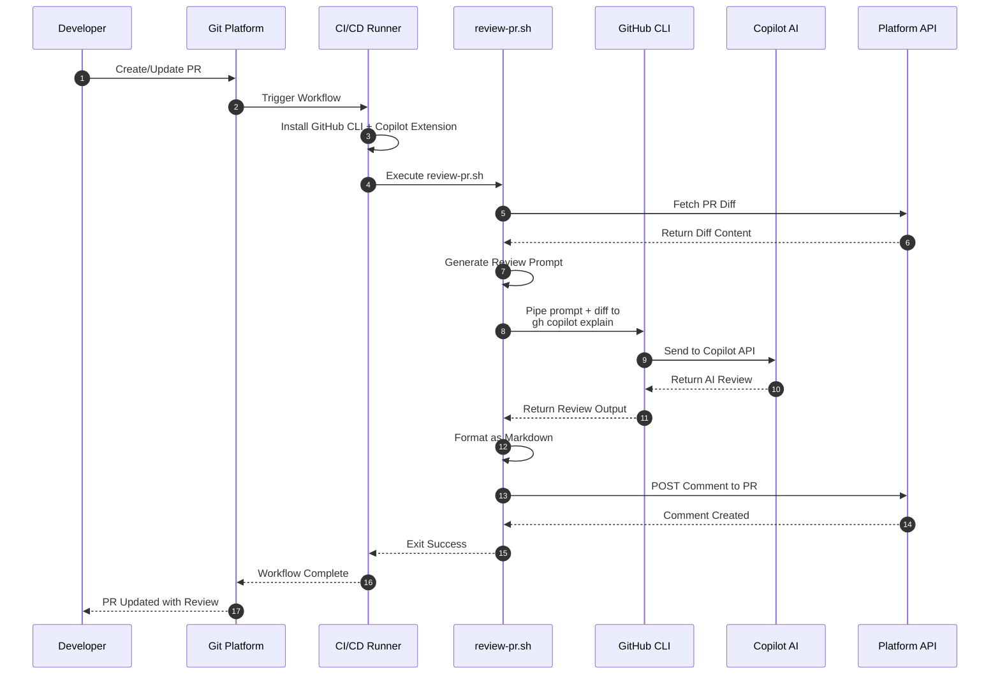
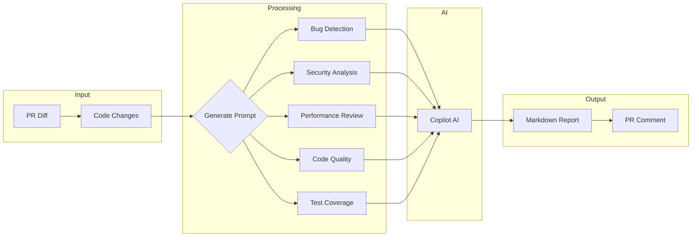
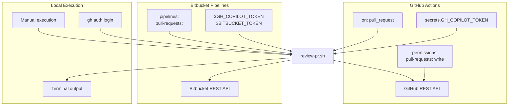

# Copilot CLI PR Code Reviewer

Automated code review for pull requests using GitHub Copilot CLI. Works on GitHub Actions, Bitbucket Pipelines, and locally.

## Architecture Overview



## How It Works



## Review Process Detail



## File Structure

```
copilot-cli-codereviewer/
├── .github/
│   └── workflows/
│       └── pr-review.yml        # GitHub Actions workflow
├── scripts/
│   ├── review-pr.sh             # Core review script (portable)
│   ├── deploy-github.sh         # GitHub deployment automation
│   ├── deploy-bitbucket.sh      # Bitbucket deployment automation
│   └── setup-local.sh           # Local environment setup
├── bitbucket-pipelines.yml      # Bitbucket Pipelines config
├── DEPLOYMENT.md                # Detailed deployment guide
└── README.md                    # This file
```

## Quick Start

### GitHub Actions

```bash
# Automated deployment
./scripts/deploy-github.sh
```

Or manually:
1. Add `GH_COPILOT_TOKEN` secret (GitHub PAT with Copilot access)
2. Copy `.github/workflows/pr-review.yml` and `scripts/review-pr.sh`
3. Create a PR to test

### Bitbucket Pipelines

```bash
# Automated deployment
./scripts/deploy-bitbucket.sh
```

Or manually:
1. Add `GH_COPILOT_TOKEN` and `BITBUCKET_TOKEN` as repository variables
2. Copy `bitbucket-pipelines.yml` and `scripts/review-pr.sh`
3. Enable Pipelines and create a PR

### Local Usage

```bash
# Setup local environment
./scripts/setup-local.sh

# Run review on current branch
cd /path/to/your/repo
PLATFORM=local /path/to/scripts/review-pr.sh
```

## Platform Comparison



## Configuration

| Variable | Description | Default |
|----------|-------------|---------|
| `PLATFORM` | Target platform | `local` |
| `REVIEW_COMMAND` | AI CLI command | `gh copilot explain` |
| `REVIEW_ARGS` | Additional CLI args | (empty) |
| `DEBUG` | Enable verbose logging | `false` |
| `MAX_COMMENT_LENGTH` | Truncate long comments | `65000` |

See [DEPLOYMENT.md](DEPLOYMENT.md) for complete configuration reference.

## Example Review Output

```markdown
## 🤖 Automated Code Review

### Summary
This PR adds a new user authentication feature with JWT token support.

### Issues Found

#### 🐛 Potential Bug
**File:** `src/auth/token.js:45`
The token expiration check uses `<` instead of `<=`, which could cause
tokens to be valid for 1 second longer than intended.

#### 🔒 Security Concern
**File:** `src/auth/password.js:23`
Password is logged in debug mode. Consider removing or masking sensitive data.

### Suggestions

- Consider adding rate limiting to the login endpoint
- Add unit tests for edge cases in token validation
- Document the new environment variables in README

### What Looks Good
- Clean separation of concerns
- Proper error handling
- Consistent code style

---
*Generated by Copilot CLI Code Reviewer*
```

## Requirements

- GitHub account with Copilot access
- GitHub CLI (`gh`) v2.0+
- `jq` for JSON processing
- `curl` for API calls

## Documentation

- [DEPLOYMENT.md](DEPLOYMENT.md) - Step-by-step deployment instructions
- [scripts/](scripts/) - Automation scripts with inline documentation

## Troubleshooting

| Issue | Solution |
|-------|----------|
| `gh copilot: command not found` | Run `gh extension install github/gh-copilot` |
| Empty review output | Check `DEBUG=true` for details |
| Comment not posting | Verify token permissions |
| Rate limiting | Wait and retry, or check quotas |

## License

MIT
